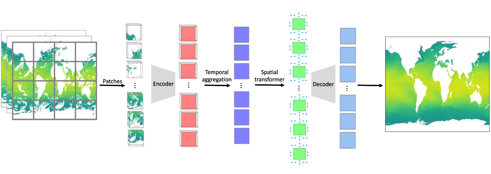

# eso4clima-wp1-prototype

[](https://opensource.org/licenses/Apache-2.0)

## Installation

We recommend using `uv` to manage the dependencies needed. Please refer to the [uv documentation](https://docs.astral.sh/uv/getting-started/installation/) for installation instructions of `uv`.

To run this workflow, first clone this repository. Inside the repository, run:

```sh
uv sync
```

This will create a virtual environment in the `.venv` folder with all the required dependencies. To activate the virtual environment, run:

```sh
source .venv/bin/activate
```

<!-- start-spatio-temporal -->
## Spatio Temporal Model Architecture



The model takes daily SST (or similar) data in video format: `x ∈ ℝ^{B × 1 × T ×
H × W}` and a `daily_mask` indicating missing pixels. It also takes
`land_mask_patch` indicating land regions in the output. The model does of the
 following tasks:

- Combines video encoder, temporal attention, spatial transformer, and decoder
- Encodes 3D data (space, time) into spatio-temporal patches
- Aggregates temporal information per spatial patch
- Mixes spatial features across patches
- Decodes back to original spatial resolution

The architecture consists of the following steps:

```bash
# 1. Patch embedding:
X (VideoEncoder)---------> X_patch

# 2. Add temporal encoding +
# 3. Temporal aggregation:
X_patch + PE (TemporalAttentionAggregator)---------> X_temp_agg

# 4. Add spatial encoding +
# 5. Spatial transformer:
X_temp_agg + PE (SpatialTransformer) ---------> X_mixed

# 6. Decode to original resolution:
X_mixed (MonthlyConvDecoder)---------> Output
```

## Model architecture description

We explain the model architecture in more detail in the [code and math
description](docs/code_math_description.md) document.

## References

- [Attention is all you need](https://doi.org/10.48550/arXiv.1706.03762)
- [VideoMAE: Masked Autoencoders are Data-Efficient Learners for Self-Supervised Video Pre-Training](https://doi.org/10.48550/arXiv.2203.12602)
- [Masked Autoencoders As Spatiotemporal Learners](
https://doi.org/10.48550/arXiv.2205.09113)
- [MAESSTRO: Masked Autoencoders for Sea Surface Temperature Reconstruction under Occlusion- 2024](https://doi.org/10.5194/os-20-1309-2024
)
